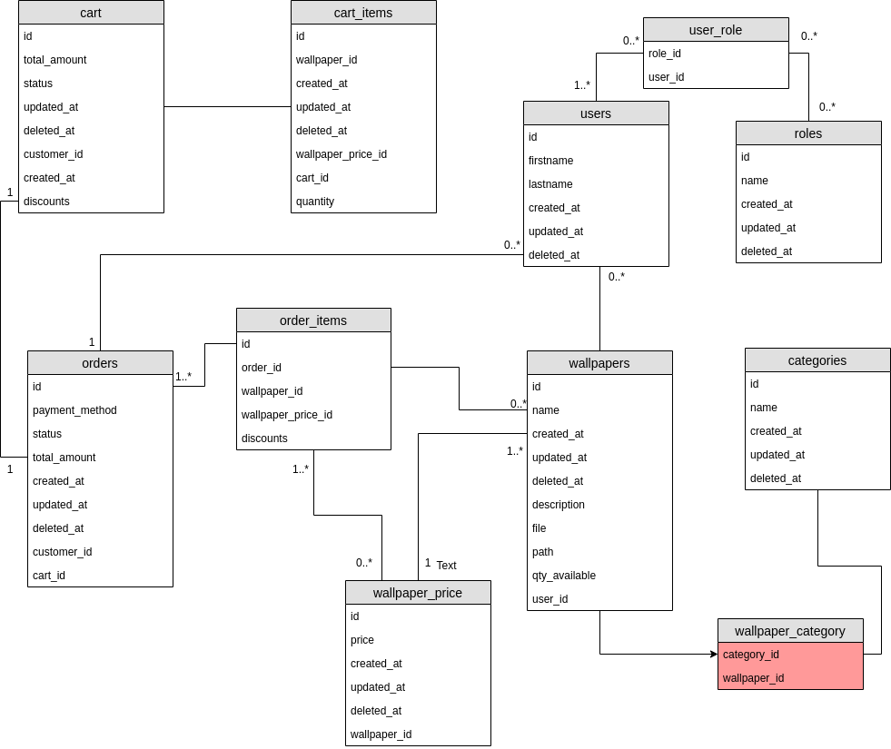
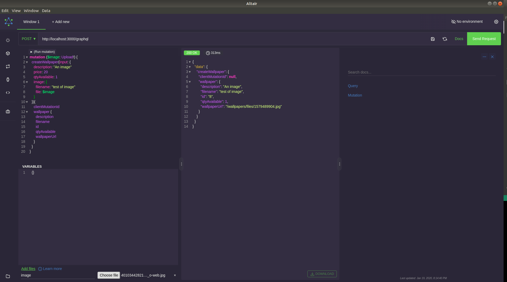

# Image Repository

## Table of Contents

<!-- vscode-markdown-toc -->
- 0. [Problem](#Problem)
- 1. [Intro](#Intro)
- 2. [Installation](#Installation)
- 3. [The Challenge](#TheChallenge)
- 4. [Demo Requirements](#DemoRequirements)
- 5. [Get Started](#GetStarted)
- 6. [Tests](#Tests)
- 7. [Resources](#Resources)

## 0. <a name='Problem'></a>Problem

The main task it was a simple as "Build an image repository" but it had some ideas to follow:

* SEARCH function:
  * from characteristics of the images from text;
  * from an image (search for similar images);
* ADD image(s) to the repository:
  * one / bulk / enormous amount of images;
  * private or public (permissions);
  * secure uploading and stored images;
* DELETE image(s):
  * one / bulk / selected / all images
  * Prevent a user deleting images from another user (access control);
  * secure deletion of images;
* SELL/BUY images:
  * ability to manage inventory;
  * set price;
  * discounts;
  * handle money.

I choose to build a mix of it and it turns at a wallpaper-repository.

## 1. <a name='Intro'></a>Intro

The wallpaper-repository is a project which started as an image upload. So imagine that people which it has any type of wallpapers such as physical ones or just online, they could create wallpapers as products with images (upload product image) then simulate an idea of store where it is possible to buy other existent products.

### Stack

#### Ruby on Rails

I decided to use *Ruby on Rails* for three reasons:
* It's a language very comfortable to work with;
* It would be a challenge to develop a new project with a language that I have been not working with;
* The Shopify is one of the largest applications in the world which works with rails.

#### Graphql

It gives a nice flexibility to clients (frontend) ask exactly what they want, also it saves a huge time, if creates a good documentation provided for each query.

The development flow was divided in few initial steps to provide a better idea about the process flow, but it was changed by my needs.

#### Database project

At first moment the project of database it was as bellow.


After that the project grow and it became as:



That diagram shows you an idea what the project it is at all, however lets do a brief about how the models are organized.

#### User
* **has_many carts** (0..n):
  * It is created one cart per time and it is just created again once the cart status is changed for purchased;
* **has_many :orders** (0..n):
  * An order is created when an user create a purchase, so that order it will have all the items from cart;
* **has_many :wallpapers** (0..n):
  * A product with an image;
* **has_and_belongs_to_many :roles** (1..n):
  * A user needs roles to create an idea of authorization.

#### Roles:
* **has_and_belongs_to_many :users** (0..n).

#### Wallpapers:
* **belongs_to :user**;
* **has_many :wallpaper_prices**
  * The idea behind of wallpaper_prices was to have a control about when a price is updated, in this way the associated orders it will not be touched or changed. Everytime when its "updated" a price it will be created a new one.

#### Orders


## 1. <a name='Requirements'></a>Requirements
- [Ruby on Rails](https://rubyonrails.org/)
<!-- - [Docker](https://www.docker.com/) -->

## 2. <a name='Installation'></a>Installation

### **Note:**

At root directory it has a file called .env.prod.sample, there are variables used by the entire application, so you have to change accordling your setup, then create a file called one as the same of the enviroment used.

For example: **.env.prod** or **.env.development** (based on the eviroment used to run the project).

### **Note 2:**

It is necessary to generate a secret key and update the value of SECRET_KEY_BASE.

* To generate the secret key you have to use a rails command find bellow, after that copy the key generated to SECRET_KEY_BASE at your .env file.

```
rails  secret
```


* <a name='RailsInstall'></a>Ruby on rails
  It is possible to use all the rails commands.
  * Install [postgresdb](https://www.postgresql.org/download/) 
  * [Altair](https://altair.sirmuel.design/)
  
  <!-- or use docker to run the postgres using 'make build_postgresdb'** -->
  ```bash
    bundle install
    rails db:create
    rails db:migrate
    rails db:seed
    rails s
  ```

## 4. <a name='DemoRequirements'></a>Demo requirements

At first sign I though to use to upload Base64 format which is accepted by GraphQL, but I found a gem for it called [Apollo-upload-server-ruby](https://github.com/jetruby/apollo_upload_server-ruby) where there I could integrate the multipart-form data, which is faster than Base64, but the problem it was **"How to upload binary data in GraphQL?"** because until then I just used **graphiql**.

I started to search and I found a really nice GraphQL Client IDE which it helps me a lot on that journey, it is called [Altair](https://altair.sirmuel.design/). Thanks a lot for it!

To upload a file at wallpaper-repository you can follow that tutorial from [working-with-file-uploads-using-altair-graphql](https://sirmuel.design/working-with-file-uploads-using-altair-graphql-d2f86dc8261f) or if you are lazy just take a look at the print bellow.



## 5. <a name='Goal'></a>Goal

The goal is build a backend api using graphql for a fuctional upload repository. The project idea is create a simple ecommerce to sell wallpapers and to make it possible it will be necessary to follow some requirements.

* Create users
* Authenticate and authorize them
* Wallpapers CRUD
  * Image upload
* Cart (Add and delete products)
* Orders
  * Generated automatically from a cart purchase.
  * List all orders
  * Get a single order


## 5. <a name='GetStarted'></a>Get Started

### Users with differents roles:

An user to access a system it has to be authenticated and have some authorization. The authentication it will allow an user to access some functionallities, the authorization it will make sure that one user it will change some information related to them and not to others.


### Authentication

For authentication it is using Devise to verify the password, after that is generated a JWT token and send to an user. For authoriation it is using the Pundit in a way to make sure that a user will change just their information.

**To authentication part is using Bearer type, so use the system is necessary to set a header: Authorization: Bearer + Token**

#### An authenticated user can:

* User Role
  * Create Wallpaper, update and delete.
  * Add and Delete products from a cart.
  * List wallpapers
  * Get informations for a single wallpaper
  * Get profile information
  * List categories paginated
  * List all orders
  * Get a single order.

* Admin role:
  * Create, update and delete Categories.
  * List users

#### Not authenticated

* List wallpapers
* Get a single wallpaper information
* Get a list of categories

### Wallpapers

You can upload an image per wallpaper by GraphQL, the images it has to be secured.

To upload images it is used a gem called Carrierwave. To upload an image it will be checked the image extension in the and it will be allowed what it was defined in a white list, just jpg, jpeg and png I also defined a black list for files of type MIME 'application/text', 'application/json', 'application/pdf', 'application/zip'.


## 6. <a name='Tests'></a>Tests

To test the application I used RSPEC, so just run:

```
rspec
```


## 7. <a name='Resources'></a>Resources

1. [Graphql ruby](https://graphql-ruby.org/)
2. [Graphql multipart request spec](https://github.com/jaydenseric/graphql-multipart-request-spec) 
3. [Apollo upload server ruby](https://github.com/jetruby/apollo_upload_server-ruby)
4. [Basic graphql authentication](https://www.howtographql.com/graphql-ruby/4-authentication/)
5. [Basic graphql authentication](https://evilmartians.com/chronicles/graphql-on-rails-2-updating-the-data)
6. [Direct uploads](https://evilmartians.com/chronicles/active-storage-meets-graphql-direct-uploads)
7. [Handling file upload using ruby on rails 5](https://www.pluralsight.com/guides/handling-file-upload-using-ruby-on-rails-5-api) 
8. [Upload images with graphql/authentication](https://rubygarage.org/blog/graphql-and-trailblazer-tutorial-part-2#article_title_5) 
9. [Upload image with gem Carrierwave](https://github.com/carrierwaveuploader/carrierwave)
10. [Carrierwave frames](https://www.rubydoc.info/gems/carrierwave/frames) 
11. [Testing graphql mutations](https://selleo.com/blog/testing-graphql-mutations-in-ruby-on-rails-with-rspec) 
12. [Pundit Policies](https://www.rubydoc.info/gems/pundit#Policies)
13. [Authorization with Pundit](https://medium.com/@NickPoorman/graphql-ruby-and-authorization-with-pundit-3d8d2102533d)
14. [Preventing tranversal attacks in your graphql api](https://blog.morethancode.dev/preventing-traversal-attacks-in-your-graphql-api/) 
15. [Create user roles](https://github.com/RolifyCommunity/rolify/)
16. [Secure images](https://github.com/carrierwaveuploader/carrierwave/wiki/how-to:-secure-upload)
17. [Graphql error handling with graphql ruby](https://dev.to/masakazutakewaka/graphql-error-handling-with-graphql-ruby-58j8)
