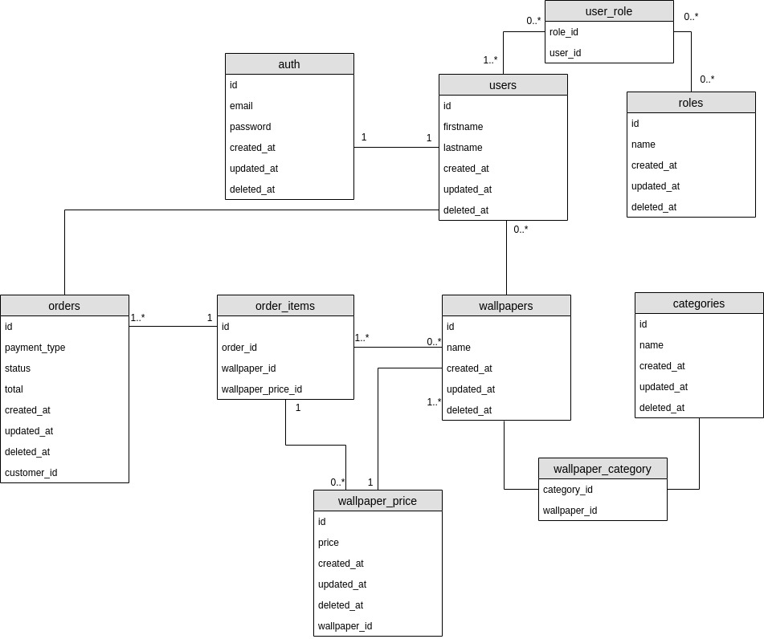

# Summer 2020 Developer Intern Challenge

## Table of Contents

<!-- vscode-markdown-toc -->
- 0. [Intro](#Intro)
- 1. [Requirements](#Requirements)
- 2. [Installation](#Installation)
- 3. [The Challenge](#TheChallenge)
- 4. [Demo Requirements](#DemoRequirements)
- 5. [Goal](#Goal)
- 6. [Application Goals](#Objects)
- 7. [Functionalities](#Functionalities)
- 8. [Makefile](#Makefile)

## 0. <a name='Intro'></a>Intro

The idea of this project it is to build an image repository furthermore I have an idea to create a wallpaper store which an user could upload their images and sell it.

I devided the development process in steps for this way to have a better idea about the process flow.

The first part it was related to the database flow:



## 1. <a name='Requirements'></a>Requirements
- [Ruby on Rails](https://rubyonrails.org/)
- [Docker](https://www.docker.com/)

## 2. <a name='Installation'></a>Installation

*Note:*

At root directory it has a file called .env.prod.sample, there are variables used by the entire application so you have to change all of them, then create a file called .env.prod or .env.development (accordling the eviroment that you are running the project).

*Note 2:*

It is necessary to generate a secret key and update the value of SECRET_KEY_BASE. To generate the secret key you have to use a rails command find bellow, after that copy the key generated to SECRET_KEY_BASE at your .env file.
```
rails  secret
```


* <a name='RailsInstall'></a>Ruby on rails
  It is possible to use all the rails commands.
  **Install [postgresdb](https://www.postgresql.org/download/) or use docker to run the postgres using 'make build_postgresdb'**
  ```bash
  bundle install
  rails db:create
  rails db:migrate
  rails db:seed
  rails s
  ```


## 3. <a name='TheChallenge'></a>The Challenge

The task is pretty much to build an image repository. A copy of official document it can be found at:
https://docs.google.com/document/d/1I6HwLUedDFFNvgzqHYm2vl3Pmm7VaZnjj3sW_9zLqkM/edit?usp=sharing

There are sugestions about what to do, I took some of them and I will join in a product where I will explain at my goals.

## 4. <a name='DemoRequirements'></a>Demo requirements

* **All of the functionality of your API should be documented so we know what it does, and how to interact with it.**

## 5. <a name='Goal'></a>Goal

The goal is build a backend api using graphql for a fuctional upload repository. The project idea is create a simple ecommerce to sell wallpaper and to make it possible it will be necessary to follow some requirements. 

- 1. Users with differents roles, one who will manage their image uploads and others who wants to buy them.
- 2. Wallappers should belongs to one user and them are the only one who will be allowed to make changes.
- 3. It will be possible to sell wallpapers for someonelse.
- 4. To sell wallpappers it needs to create an order to process the information.
- 5. To find wallpappers the system must provide filters:
    - 5.1. by description.
    - 5.2. by meta
    - 5.3. by category (each wallpaper can has more than one category.) 


## 6. <a name='Application Goals'></a>Application Goals

* Note: The main side goal is to make tests for all resources of application * 

I divided the development as followed:
- 0. Setup the basic libraries.
- 1. Create users.
- 2. Create authentication with roles.
- 3. Create Image object to upload them.
- 4. Create way to resize image keep maximum quality to save storage space.
- 5. Create Categories.
- 6. Create Order.


## 6. <a name='Makefile'></a>MakeFile

Commands            | Action                                                     |
---                 | ---                                                        |
run                 | Run application outside container using rails              |
build_postgresdb    | Start a postgresdb in container (Just if is not installed) |
createdb            | Create database |

--- 

## 7. <a name='Resources'></a>Resources

1. [Graphql ruby](https://graphql-ruby.org/)
2. [Graphql multipart request spec](https://github.com/jaydenseric/graphql-multipart-request-spec) 
3. [Apollo upload server ruby](https://github.com/jetruby/apollo_upload_server-ruby)
4. [Basic graphql authentication](https://www.howtographql.com/graphql-ruby/4-authentication/)
5. [Basic graphql authentication](https://evilmartians.com/chronicles/graphql-on-rails-2-updating-the-data)
6. [Direct uploads](https://evilmartians.com/chronicles/active-storage-meets-graphql-direct-uploads)
7. [Handling file upload using ruby on rails 5](https://www.pluralsight.com/guides/handling-file-upload-using-ruby-on-rails-5-api) 
8. [Upload images with graphql/authentication](https://rubygarage.org/blog/graphql-and-trailblazer-tutorial-part-2#article_title_5) 
9. [Upload image with gem Carrierwave](https://github.com/carrierwaveuploader/carrierwave)
10. [Carrierwave frames](https://www.rubydoc.info/gems/carrierwave/frames) 
11. [Testing graphql mutations](https://selleo.com/blog/testing-graphql-mutations-in-ruby-on-rails-with-rspec) 
12. [Pundit Policies](https://www.rubydoc.info/gems/pundit#Policies)
13. [Authorization with Pundit](https://medium.com/@NickPoorman/graphql-ruby-and-authorization-with-pundit-3d8d2102533d)
14. [Preventing tranversal attacks in your graphql api](https://blog.morethancode.dev/preventing-traversal-attacks-in-your-graphql-api/) 
15. [Create user roles](https://github.com/RolifyCommunity/rolify/)
